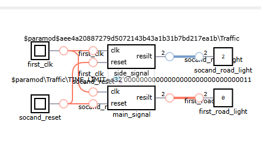
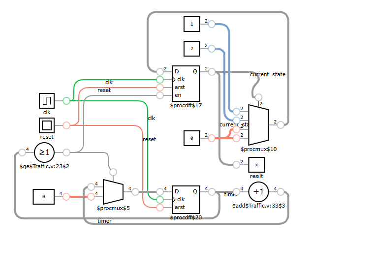

# VeriTraffic System 🚦

A modular, hardware-level traffic management solution designed for real-time synchronization of urban intersections using **Verilog HDL**[cite: 1].

## 📝 Overview
The VeriTraffic System provides a deterministic **Register-Transfer Level (RTL)** architecture to bypass the latency issues inherent in software-based controllers[cite: 1]. It ensures safety-critical state transitions between "Main" and "Side" roads through parametric synchronization[cite: 1].

## 🛠 Features
*   **Collision Prevention:** Utilizes parameter overriding to ensure intersecting roads never receive a "Green" signal simultaneously[cite: 1].
*   **Hardware Efficiency:** Optimized for deployment on the **Cyclone IV GX FPGA** family[cite: 1].
*   **Safety Buffers:** Implements a "clearance interval" in the Red state using a $TIME\_LIMIT \times 2$ multiplier to allow intersections to empty[cite: 1].

## 🏗 System Architecture
The design follows a **Hierarchical Structural Pattern**, where the `city` module acts as the master orchestrator for dual **Finite State Machines (FSMs)**[cite: 1].

### Top-Level RTL Diagram

*Figure 1: RTL Diagram showing the orchestration of main_signal and side_signal units[cite: 1].*

## ⚙️ Technical Details
The core logic is a **Moore Machine** where the output depends solely on the current state[cite: 1]. 

*   **State Encoding:** 2-bit register (`reg [1:0]`)[cite: 1].
*   **Timer:** 4-bit register (`reg [3:0]`) managing state durations[cite: 1].
*   **Transition Sequence:** $Green \rightarrow Yellow \rightarrow Red$[cite: 1].

### Internal FSM Logic

*Figure 2: Detailed internal logic showing the state register, timer, and transition multiplexers[cite: 1].*

## ⚠️ Critical Evaluation & Constraints
*   **Timer Bottleneck:** The 4-bit timer ($2^4 = 16$ states) is a potential vulnerability. If $TIME\_LIMIT \times 2$ exceeds 15, the counter will overflow, leading to a "stuck" state[cite: 1].
*   **Naming Issues:** Note the `resilt` typo in the source port mapping, which should be updated to `result` for better maintainability[cite: 1].
*   **Reset Logic:** Uses an asynchronous reset, which is robust but requires careful physical debouncing[cite: 1].

## 🚀 Future Roadmap
*   Expand timer bit-width (8 or 16 bits) for real-world timing[cite: 1].
*   Implement a **Synchronous Reset** for improved stability[cite: 1].
*   Integrate a **UART module** for real-time timing updates from a central server[cite: 1].

---
**Author:** Ibrahim Raafat Al-Saqqa  
*Computer Engineering Student - University of Jordan*
